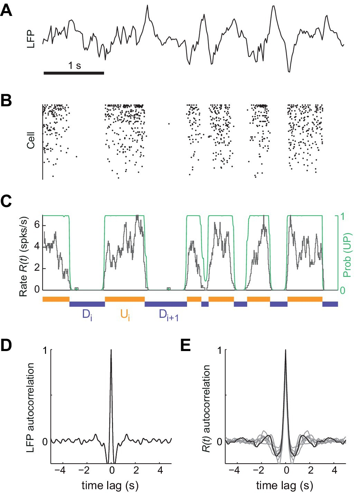
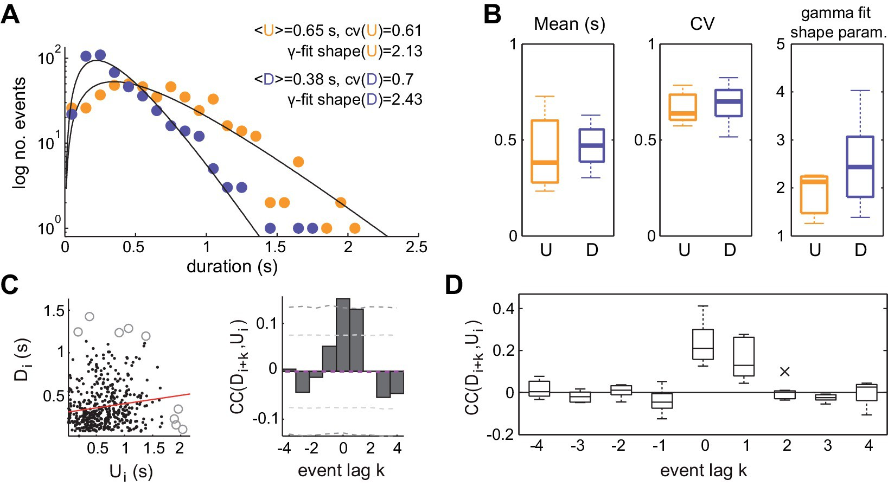
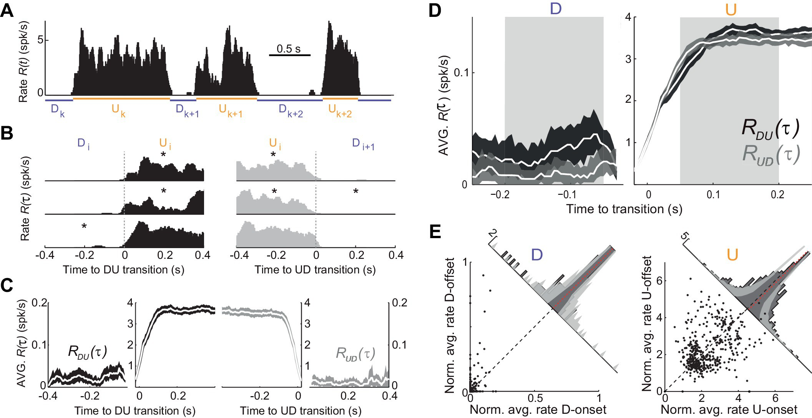
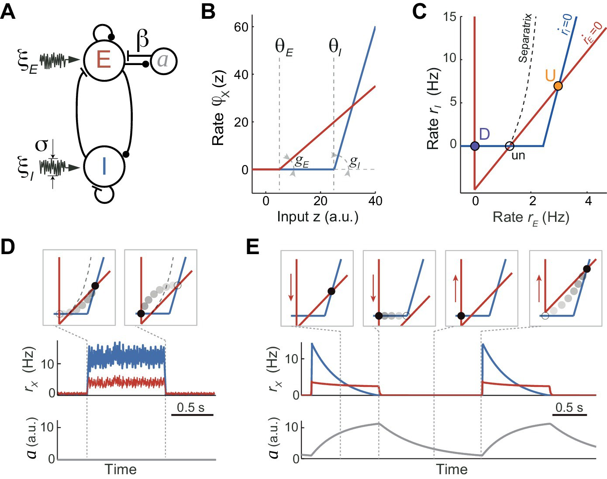
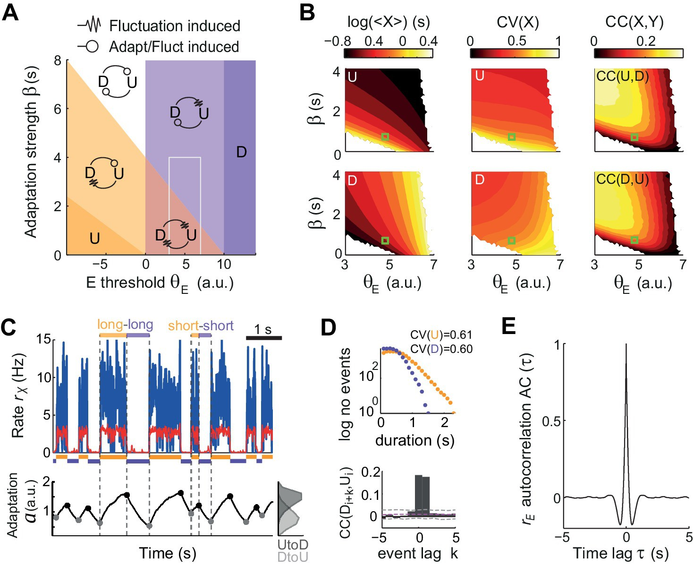
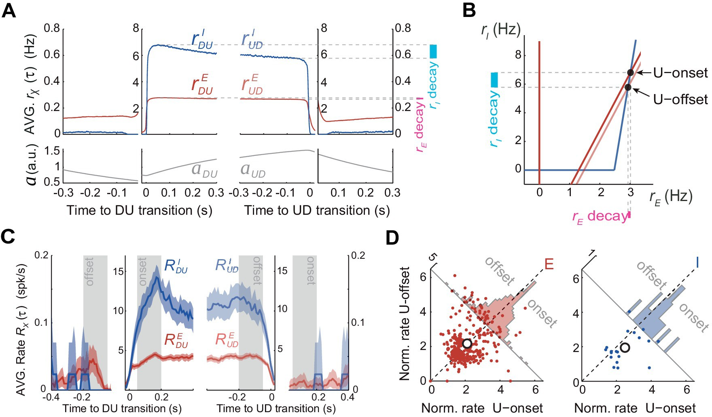
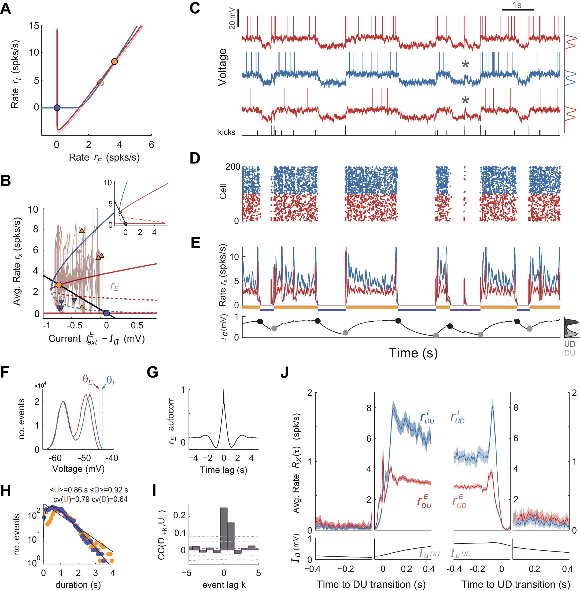

% UP-DOWN cortical dynamics reflect state transitions in a bistable network
% Daniel Jercong, Alex Roxin, Peter Barthó, Artur Luczak, Albert Compte, Jaime de la Rocha
% Paper Club, UNIC, Gif-sur-Yvette, 2017

# Detecting UP and DOWN states 
{height=60%}

# UP and DOWN statistics

# Dynamics of population rate in UP and DOWN states

# Simplified rate model of UP and DOWN states

{width=75%}

# Exploring the parameter space

{width=75%}

# Dynamics of the inhibitory and excitatory firing rate in the model

# Spiking network model of UP and DOWN state

{height=60%}

# Key Points

* irregular up-down transitions
* serial correlations between UP/DOWN states lengths
* noise- vs adaptation-driven transitions
* change of firing rate at the onset vs. offset of UP state in inhibitory and excitatory neurons
* DOWN to UP transitions in realistic models with moderate noise
* origins of "kicks" - hand waving arguments (sparse connectivity, synchronous events, thalmocortical inputs)
* inhibition stabilised vs. shunting inhibition (Kumar 2008, Latham 2000) vs. contractive nonlinearity (Amit & Brunel, 1997)
